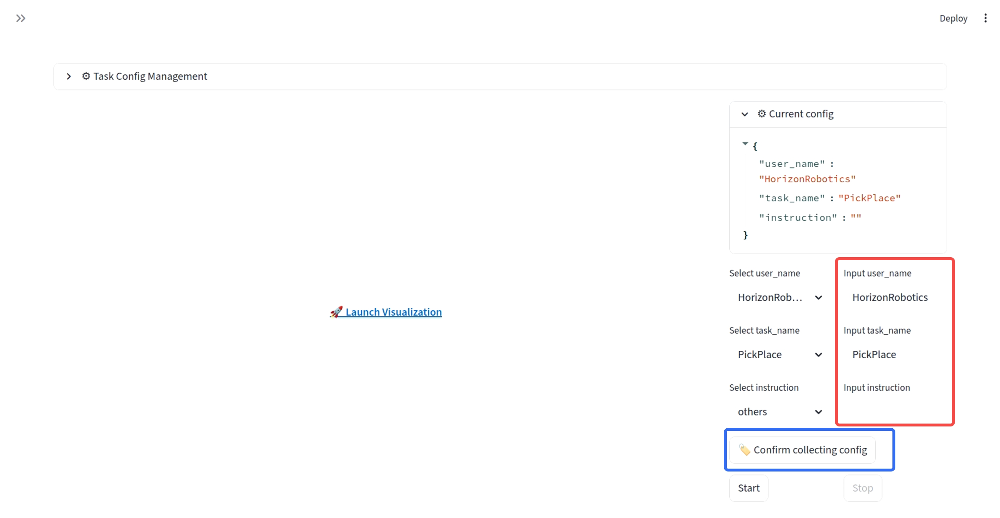
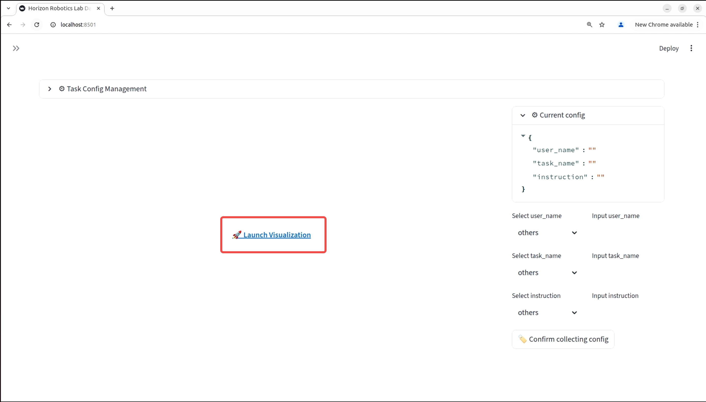
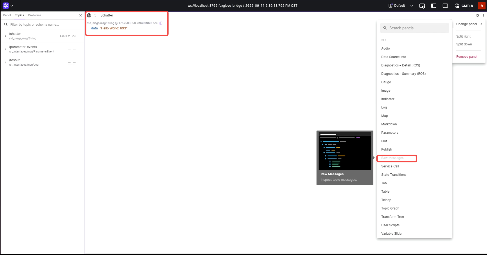
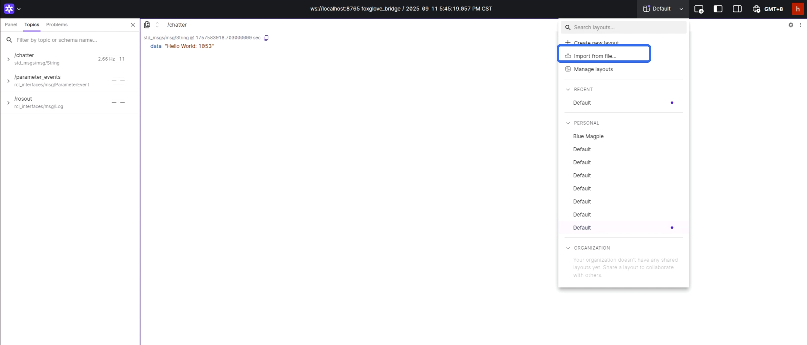
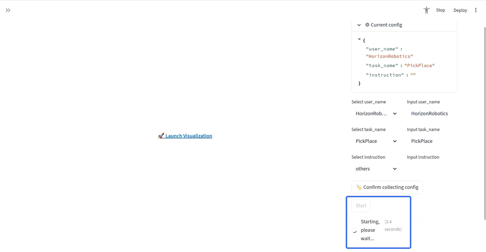
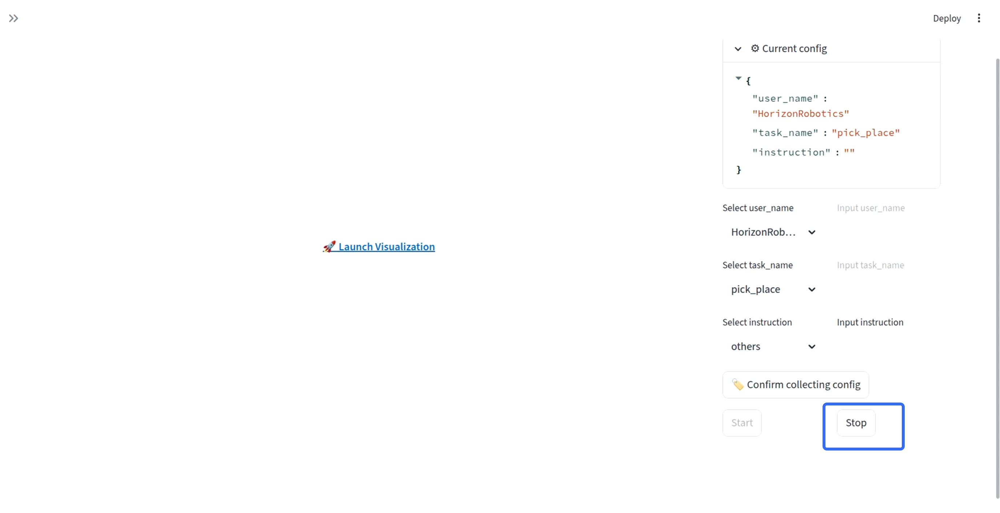
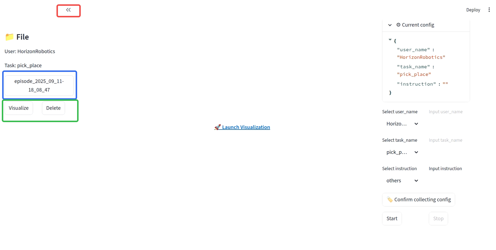

# Example: Real-time Visualization and Recording

This example demonstrates a complete workflow for the RoboOrchard Data Recorder. We will:

1. Launch the main application UI and the necessary ROS 2 nodes.
2. Visualize a live ROS 2 topic (`/chatter`) in real-time using the integrated Foxglove panel.
3. Record the topic data into an MCAP file.
4. Accessing the final data file.

## Prerequisites
Before running the example, ensure you have installed the foxglove_bridge for ROS 2. You can follow the official installation instructions [here](https://docs.foxglove.dev/docs/visualization/ros-foxglove-bridge).

## How to Run

You will need **4 separate terminals** for this example. Make sure to source your ROS 2 environment in each one.

### Terminal 1: Launch the Main Application

```bash
# Navigate to the repository root
cd /path/to/your/repo

# Source the local workspace
source ros2_package/install/setup.bash

# Launch the Streamlit Web UI and recorder node
bash basic/launch_app.sh
```

After running this, your terminal will display a URL, typically `http://localhost:8501`. Copy this URL and open it in your web browser to access the application.

### Terminal 2: Launch the Foxglove Bridge

The Foxglove Bridge is required to stream live data from ROS 2 to the visualizer.

```bash
# Source the workspace
source /path/to/your/ros2/install/setup.bash

# Launch the bridge
ros2 launch foxglove_bridge foxglove_bridge_launch.py
```

### Terminal 3: Start a simple http file server

```bash
ROBO_ORCHARD_SIMPLE_FILE_SERVER_BASE_DIR=/ robo-orchard-simple-file-server --port 8000
```

### Terminal 4: Start a Sample Data Publisher

```bash
# Source the workspace
source /path/to/your/ros2/install/setup.bash

# Launch the bridge
ros2 run demo_nodes_cpp talker
```

## Using the Application

### Part 1: Task Configuration

First, we will set up the metadata for our data collection session.

1. Open the Application: Launch the application and open the provided URL in your web browser (e.g., `http://localhost:8501`). You will see the main dashboard.

2. Set Collection Parameters: On the right-hand sidebar under Task Config Management, you need to define the task parameters.

- You can either select a pre-existing `user_name`, `task_name`, and `instruction` from the dropdown menus or type a new custom entry in the corresponding "Input" fields.

- As you fill in the details, the Current config JSON view will update in real-time.

3. Confirm the Configuration: Once you are satisfied with the parameters, click the `Confirm collecting config` button. This will lock in the settings and prepare the system for recording. After confirmation, the `Start` and `Stop` buttons will become active.



### Part 2: Real-time Visualization with Foxglove

Before recording, you can inspect the live data streams to ensure everything is working correctly.

1. Launch the Visualizer: In the center of the screen, click the `🚀 Launch Visualization` button. This will open an embedded Foxglove Studio interface.



2. View Live Topics: Inside the Foxglove panel:

The system will automatically connect to the live data stream (e.g., `ws://localhost:8765`).

On the left, you will see a list of all available ROS 2 topics.

To visualize a topic, click `Add Panel` on the right and choose a panel type, such as `Raw Messages`.

In the panel's settings, enter the topic name you wish to view (e.g., `/chatter`). You will now see the messages streaming in real-time.



3. (Optional) Import a Layout: For more complex visualizations, you can import a pre-configured Foxglove layout. Click on the layout menu in the top-right corner and select `Import from file`. For more details, refer to the official Foxglove Layouts [documentation](https://docs.foxglove.dev/docs/visualization/layouts).



### Part 3: Data Recording

Once you have confirmed the data streams are correct, you can begin recording.

1. Start Recording: On the right-hand sidebar, click the `Start` button. You will see a "Starting, please wait..." status as the system initializes. Once ready, the status will change to "Recording...".



2. Stop Recording: When you have collected enough data, click the `Stop` button. The recording session will end, and the MCAP file will be saved.



### Part 4: Accessing Recorded Data

After recording, you can manage and review your data directly from the UI.

1. Open the File Browser: In the top-left corner of the application, click the sidebar icon (`<<`). This will open the file browser.

2. Manage Your Data: The browser organizes files by `User` and `Task`.

Navigate to the recording you just made (e.g., `episode_2025_09_11-18_08_47`).

You have two options:

- **Visualize**: This will open the recorded MCAP file in the Foxglove panel for playback and analysis.
- **Delete**: This will permanently remove the recorded data.



3. Locate Files on Disk: The recorded data is saved to the workspace directory specified in your configuration. The directory structure is organized as follows:

```bash
workspace/
└── {YYYY_MM_DD-HH_MM_SS}/
    ├── data/
    │   └── {user_name}/
    │       └── {task_name}/
    │           └── episode_{YYYY_MM_DD-HH_MM_SS}/
    │               ├── episode_{...}_0.mcap
    │               ├── episode_meta.json
    │               └── metadata.yaml
    └── logs/
        └── {user_name}/
            └── {task_name}/
```

## Advanced: The Official "Challenge Cup" Configuration

[This example](./challenge_cup/) is for advanced users or those who want to use a comprehensive, production-ready configuration as a template for their own robot. It includes the exact configuration file we used to collect the official **challenge_cup** [dataset](https://huggingface.co/datasets/HorizonRobotics/Real-World-Dataset).

By studying this example, you will see how to handle a real-world robotics setup, including:

- Advanced topic filtering and management.
- Per-topic QoS profile settings.
- Real-time data integrity monitoring.
